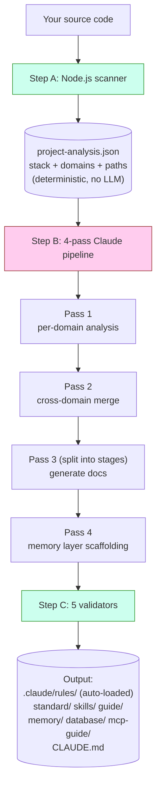
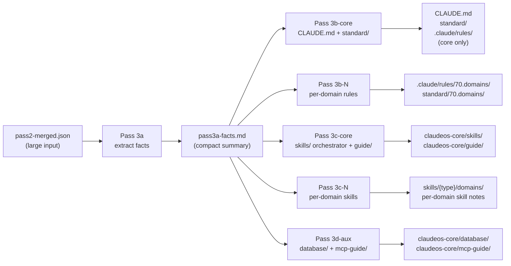
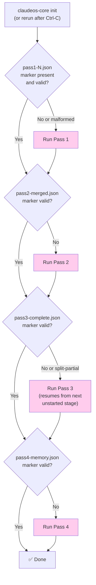
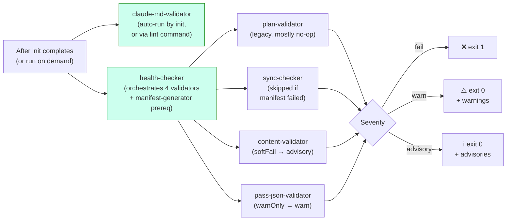
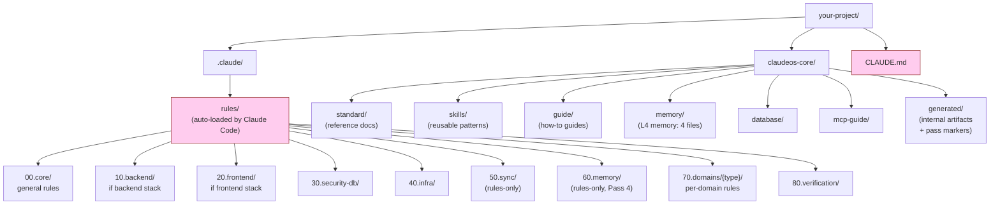

# Diagrams

Visuelle Referenzen zur Architektur. Alle Diagramme sind in Mermaid und werden auf GitHub automatisch gerendert. Wer das in einem Nicht-Mermaid-Viewer liest: die Prosa-Erklärungen sind absichtlich eigenständig vollständig.

Für die Nur-Text-Variante siehe [architecture.md](architecture.md).

> Englisches Original: [docs/diagrams.md](../diagrams.md). Die deutsche Übersetzung wird mit der englischen Version synchron gehalten.

---

## Wie `init` funktioniert (auf hoher Ebene)



**Grün** = Code (deterministisch). **Pink** = Claude (LLM). Die beiden überschneiden sich nie bei derselben Aufgabe.

---

## Pass-3-Split-Modus

Pass 3 läuft unabhängig von der Projektgröße immer in Stages, niemals als einzelne Invocation. So bleibt der Prompt jeder Stage im LLM-Kontextfenster, selbst wenn `pass2-merged.json` groß ist:



**Kerngedanke:** Pass 3a liest die große Eingabe einmal und produziert eine kleine Faktentabelle. Stages 3b/3c/3d lesen nur diese kleine Faktentabelle, nie erneut die große Eingabe. Das verhindert „Prompt is too long"-Fehler, die frühere Nicht-Split-Designs ständig plagten.

Bei Projekten mit 16+ Domains werden 3b und 3c weiter in Batches von ≤15 Domains zerlegt. Jeder Batch ist eine eigene Claude-Invocation mit frischem Kontextfenster.

---

## Wiederaufnahme nach Unterbrechung



Pinke Boxen = Claude wird aufgerufen. Die Rauten-Entscheidungen sind reine Dateisystem-Prüfungen, sie passieren vor jedem LLM-Aufruf.

Die Marker-Validierung fragt nicht nur „Existiert die Datei?". Jeder Marker hat strukturelle Prüfungen, etwa muss der Pass-4-Marker `passNum === 4` und ein nicht-leeres `memoryFiles`-Array enthalten. Kaputte Marker aus abgestürzten vorherigen Läufen werden abgelehnt und der Pass läuft erneut.

---

## Verifikationsfluss



Die drei Schweregrade bedeuten: CI scheitert nicht an Warnungen oder Hinweisen, nur an harten Fehlern (`fail`-Stufe).

`claude-md-validator` läuft separat, weil seine Befunde **strukturell** sind. Ist CLAUDE.md fehlerhaft, lautet die richtige Antwort: `init` neu ausführen, nicht still warnen. Die anderen Validatoren laufen als Teil von `health`, denn ihre Befunde sind inhaltlich (Pfade, Manifest-Einträge, Schema-Lücken). Die lassen sich prüfen, ohne alles neu zu generieren.

---

## Dateisystem nach `init`



**Pink** = Claude Code lädt diese Dateien in jeder Session automatisch (du lädst sie nicht von Hand). Alles andere wird auf Anforderung geladen oder von den automatisch geladenen Dateien referenziert.

Die Präfixe `00`/`10`/`20`/`30`/`40`/`70`/`80` erscheinen **sowohl** in `rules/` als auch `standard/`: derselbe konzeptionelle Bereich, andere Rolle. Rules sind geladene Direktiven, Standards Referenzdokumente. Die numerischen Präfixe sorgen für stabile Sortierung und erlauben es dem Pass-3-Orchestrator, Kategorie-Gruppen gezielt anzusprechen (etwa schreibt Pass 4 nach 60.memory, 70.domains läuft pro Batch). Ob Claude Code eine Regel automatisch lädt, entscheidet aber der `paths:`-Glob in ihrem YAML-Frontmatter, nicht die Kategorienummer.

`50.sync` und `60.memory` sind **rules-only** (kein dazugehöriges `standard/`-Verzeichnis). `90.optional` ist **standard-only** (stackspezifische Ergänzungen ohne Durchsetzung).

---

## Memory-Schicht-Interaktion mit Claude-Code-Sessions

```mermaid
flowchart TD
    A["You start a Claude Code session"] --> B{"CLAUDE.md<br/>auto-loaded?"}
    B -->|Yes (always)| C["Section 8 lists<br/>memory/ files"]
    C --> D{"Working file matches<br/>a paths: glob in<br/>60.memory rules?"}
    D -->|Yes| E["Memory rule<br/>auto-loaded"]
    D -->|No| F["Memory not loaded<br/>(saves context)"]

    G["Long session running"] --> H{"Auto-compact<br/>at ~85% context?"}
    H -->|Yes| I["Session Resume Protocol<br/>(prose in CLAUDE.md §8)<br/>tells Claude to re-read<br/>memory/ files"]
    I --> J["Claude continues<br/>with memory restored"]

    style B fill:#fce,stroke:#933
    style D fill:#fce,stroke:#933
    style H fill:#fce,stroke:#933
```

Die Memory-Dateien laden **bei Bedarf**, nicht immer. Das hält Claudes Kontext beim normalen Coden schlank. Sie kommen nur ins Spiel, wenn der `paths:`-Glob der Regel die aktuell von Claude bearbeitete Datei matcht.

Details zu jeder Memory-Datei und zur Funktionsweise des Compaction-Algorithmus stehen in [memory-layer.md](memory-layer.md).
