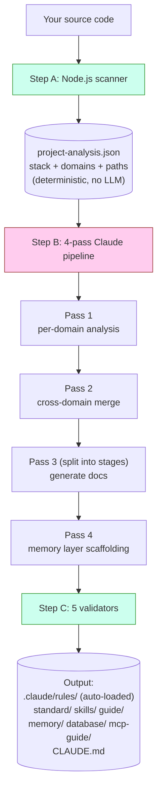
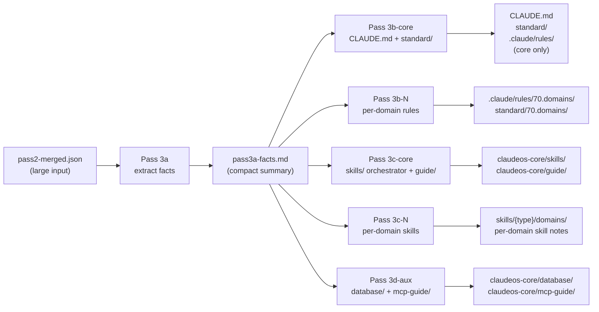
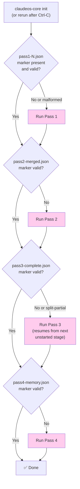
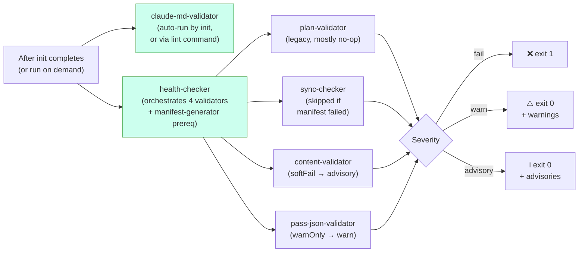
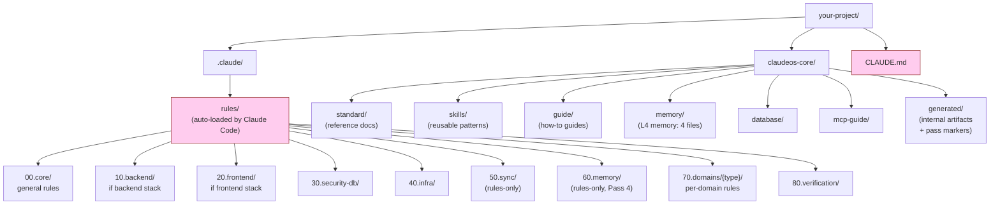

# Diagrams

Visual references for the architecture. All diagrams are Mermaid — they render automatically on GitHub. If you're reading this in a non-Mermaid viewer, the prose explanations are deliberately complete on their own.

For the words-only version, see [architecture.md](architecture.md).

---

## How `init` works (high level)



**Green** = code (deterministic). **Pink** = Claude (LLM). The two never overlap on the same job.

---

## Pass 3 split mode

Pass 3 always splits into stages — never runs as a single invocation, regardless of project size. This keeps each stage's prompt within the LLM's context window even when `pass2-merged.json` is large:



**Key insight:** Pass 3a reads the big input once and produces a small fact sheet. Stages 3b/3c/3d only read the small fact sheet, never re-read the big input. This avoids "Prompt is too long" errors that plagued earlier non-split designs.

For projects with 16+ domains, 3b and 3c sub-divide further into batches of ≤15 domains each. Each batch is its own Claude invocation with a fresh context window.

---

## Resume from interruption



Pink boxes = Claude is invoked. The diamond decisions are pure file-system checks — they happen before any LLM call.

The marker validation isn't just "does the file exist?" — each marker has structural checks (e.g., Pass 4's marker must contain `passNum === 4` and a non-empty `memoryFiles` array). Malformed markers from crashed previous runs are rejected and the pass re-runs.

---

## Verification flow



Three-tier severity means CI doesn't fail on warnings or advisories — only on hard failures (`fail` tier).

`claude-md-validator` runs separately because its findings are **structural** — if CLAUDE.md is malformed, the right answer is to re-run `init`, not to silently warn. The other validators run as part of `health` because their findings are content-level (paths, manifest entries, schema gaps) — those can be reviewed without re-generating everything.

---

## File system after `init`



**Pink** = auto-loaded by Claude Code each session (you don't manually load them). Everything else is loaded on demand or referenced from the auto-loaded files.

The `00`/`10`/`20`/`30`/`40`/`70`/`80` prefixes appear in **both** `rules/` and `standard/` — same conceptual area, different role (rules are loaded directives, standards are reference docs). The numeric prefixes give a stable sort order and let the Pass 3 orchestrator address category groups (e.g., 60.memory is written by Pass 4, 70.domains is written per batch). What actually triggers Claude Code to auto-load a rule is the `paths:` glob in its YAML frontmatter, not its category number.

`50.sync` and `60.memory` are **rules-only** (no matching `standard/` directory). `90.optional` is **standard-only** (stack-specific extras with no enforcement).

---

## Memory layer interaction with Claude Code sessions

```mermaid
flowchart TD
    A["You start a Claude Code session"] --> B{"CLAUDE.md<br/>auto-loaded?"}
    B -->|Yes (always)| C["Section 8 lists<br/>memory/ files"]
    C --> D{"Working file matches<br/>a paths: glob in<br/>60.memory rules?"}
    D -->|Yes| E["Memory rule<br/>auto-loaded"]
    D -->|No| F["Memory not loaded<br/>(saves context)"]

    G["Long session running"] --> H{"Auto-compact<br/>at ~85% context?"}
    H -->|Yes| I["Session Resume Protocol<br/>(prose in CLAUDE.md §8)<br/>tells Claude to re-read<br/>memory/ files"]
    I --> J["Claude continues<br/>with memory restored"]

    style B fill:#fce,stroke:#933
    style D fill:#fce,stroke:#933
    style H fill:#fce,stroke:#933
```

The memory files are loaded **on demand**, not always. This keeps Claude's context lean during normal coding. They're only pulled in when the rule's `paths:` glob matches the file Claude is currently editing.

For details on what each memory file contains and the compaction algorithm, see [memory-layer.md](memory-layer.md).
