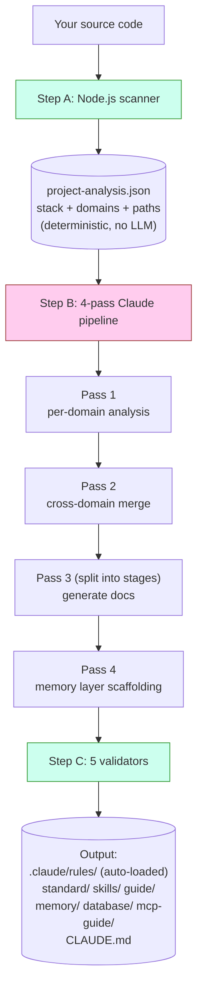
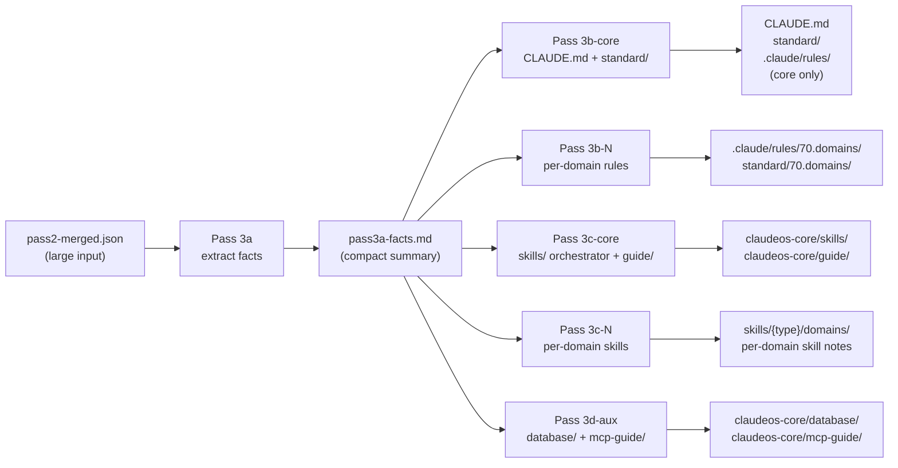
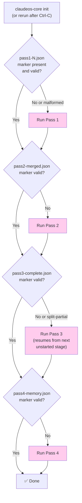
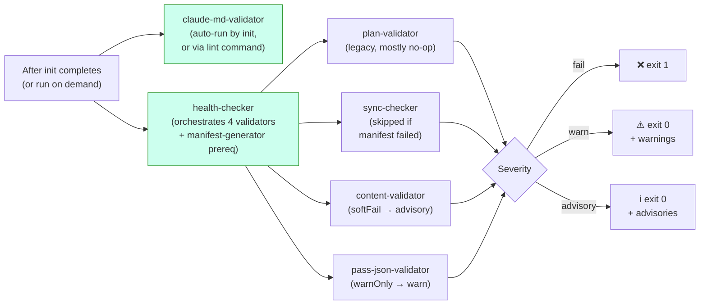
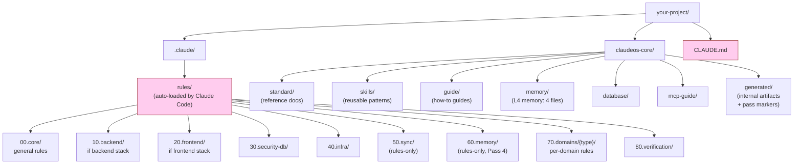

# Diagramas

Referencias visuales para la arquitectura. Todos los diagramas son Mermaid — se renderizan automáticamente en GitHub. Si estás leyendo esto en un visor sin soporte Mermaid, las explicaciones en prosa son intencionalmente completas por sí mismas.

Para la versión solo-palabras, ver [architecture.md](architecture.md).

> Original en inglés: [docs/diagrams.md](../diagrams.md). La traducción al español se mantiene sincronizada con el inglés.

---

## Cómo funciona `init` (alto nivel)



**Verde** = código (determinístico). **Rosa** = Claude (LLM). Los dos nunca se solapan en el mismo trabajo.

---

## Pass 3 split mode

Pass 3 siempre se divide en etapas — nunca corre como una invocación única, independientemente del tamaño del proyecto. Esto mantiene el prompt de cada etapa dentro de la ventana de contexto del LLM incluso cuando `pass2-merged.json` es grande:



**Insight clave:** Pass 3a lee la entrada grande una vez y produce una pequeña hoja de hechos. Las etapas 3b/3c/3d solo leen la pequeña hoja de hechos, nunca releen la entrada grande. Esto evita los errores "Prompt is too long" que plagaron los diseños no-split anteriores.

Para proyectos con 16+ dominios, 3b y 3c se subdividen en batches de ≤15 dominios cada uno. Cada batch es su propia invocación a Claude con una ventana de contexto fresca.

---

## Resume desde interrupción



Los cuadros rosas = Claude se invoca. Las decisiones en diamante son checks puros del filesystem — ocurren antes de cualquier llamada LLM.

La validación del marker no es solo "¿existe el archivo?" — cada marker tiene checks estructurales (p. ej., el marker de Pass 4 debe contener `passNum === 4` y un array `memoryFiles` no vacío). Los markers malformados de ejecuciones previas crasheadas se rechazan y el pase se re-ejecuta.

---

## Flujo de verificación



La severidad de tres niveles significa que CI no falla en warnings o advisories — solo en hard failures (tier `fail`).

`claude-md-validator` corre por separado porque sus hallazgos son **estructurales** — si CLAUDE.md está malformado, la respuesta correcta es re-ejecutar `init`, no avisar silenciosamente. Los otros validators corren como parte de `health` porque sus hallazgos son a nivel de contenido (paths, entradas de manifest, brechas de schema) — esos pueden revisarse sin regenerar todo.

---

## Sistema de archivos después de `init`



**Rosa** = auto-cargado por Claude Code en cada sesión (no los cargas manualmente). Todo lo demás se carga bajo demanda o se referencia desde los archivos auto-cargados.

Los prefijos `00`/`10`/`20`/`30`/`40`/`70`/`80` aparecen en **ambos** `rules/` y `standard/` — misma área conceptual, rol distinto (las rules son directivas cargadas, los standards son docs de referencia). Los prefijos numéricos dan un orden de sort estable y permiten que el orquestador de Pass 3 direccione grupos de categorías (p. ej., 60.memory lo escribe Pass 4, 70.domains se escribe por batch). Lo que realmente dispara que Claude Code auto-cargue una regla es el glob `paths:` en su YAML frontmatter, no su número de categoría.

`50.sync` y `60.memory` son **solo rules** (sin directorio `standard/` correspondiente). `90.optional` es **solo standard** (extras específicos del stack sin enforcement).

---

## Interacción del memory layer con sesiones de Claude Code

```mermaid
flowchart TD
    A["You start a Claude Code session"] --> B{"CLAUDE.md<br/>auto-loaded?"}
    B -->|Yes (always)| C["Section 8 lists<br/>memory/ files"]
    C --> D{"Working file matches<br/>a paths: glob in<br/>60.memory rules?"}
    D -->|Yes| E["Memory rule<br/>auto-loaded"]
    D -->|No| F["Memory not loaded<br/>(saves context)"]

    G["Long session running"] --> H{"Auto-compact<br/>at ~85% context?"}
    H -->|Yes| I["Session Resume Protocol<br/>(prose in CLAUDE.md §8)<br/>tells Claude to re-read<br/>memory/ files"]
    I --> J["Claude continues<br/>with memory restored"]

    style B fill:#fce,stroke:#933
    style D fill:#fce,stroke:#933
    style H fill:#fce,stroke:#933
```

Los archivos de memoria se cargan **bajo demanda**, no siempre. Esto mantiene el contexto de Claude ligero durante coding normal. Solo se traen cuando el glob `paths:` de la regla coincide con el archivo que Claude está editando actualmente.

Para detalles sobre lo que contiene cada archivo de memoria y el algoritmo de compactación, ver [memory-layer.md](memory-layer.md).
