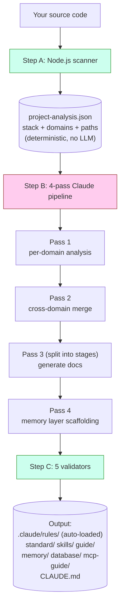
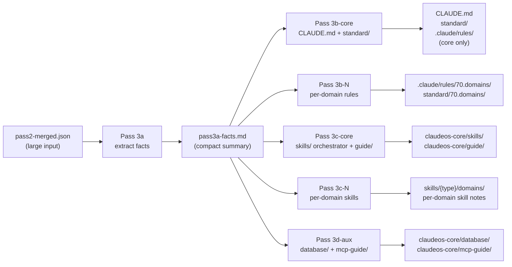
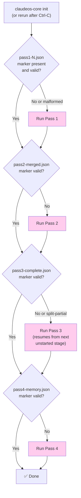
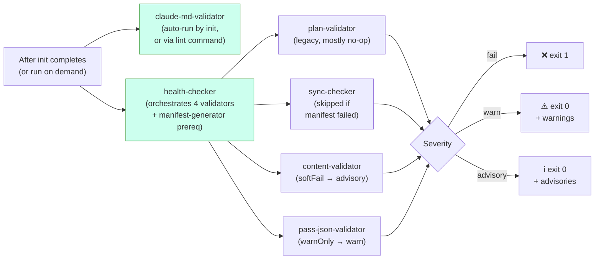
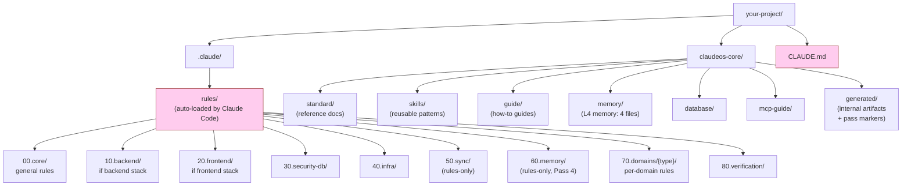

# Diagrammes

Références visuelles pour l'architecture. Tous les diagrammes sont en Mermaid — ils s'affichent automatiquement sur GitHub. Si vous lisez ceci dans un viewer non-Mermaid, les explications en prose sont délibérément complètes par elles-mêmes.

Pour la version words-only, voir [architecture.md](architecture.md).

> Original anglais : [docs/diagrams.md](../diagrams.md). La traduction française est maintenue synchronisée avec l'anglais.

---

## Comment fonctionne `init` (high level)



**Vert** = code (déterministe). **Rose** = Claude (LLM). Les deux ne se chevauchent jamais sur le même job.

---

## Pass 3 split mode

Pass 3 se divise toujours en stages — ne s'exécute jamais comme une seule invocation, quelle que soit la taille du projet. Cela garde le prompt de chaque stage dans la context window du LLM même quand `pass2-merged.json` est gros :



**Insight clé :** Pass 3a lit le gros input une fois et produit une petite fact sheet. Les stages 3b/3c/3d ne lisent que la petite fact sheet, ne relisent jamais le gros input. Cela évite les erreurs « Prompt is too long » qui plaguaient les designs antérieurs sans split.

Pour les projets à 16+ domaines, 3b et 3c se subdivisent encore en batches de ≤15 domaines chacun. Chaque batch est sa propre invocation Claude avec une context window fraîche.

---

## Resume après interruption



Les boîtes roses = Claude est invoqué. Les diamants de décision sont des checks file-system purs — ils se passent avant tout appel LLM.

La validation du marker n'est pas juste « le fichier existe-t-il ? » — chaque marker a des checks structurels (par ex. le marker de Pass 4 doit contenir `passNum === 4` et un array `memoryFiles` non-vide). Les markers mal formés issus de runs antérieurs crashés sont rejetés et la pass se réexécute.

---

## Flux de vérification



La sévérité 3-tier signifie que la CI n'échoue pas sur les warnings ou advisories — uniquement sur les hard failures (tier `fail`).

`claude-md-validator` s'exécute séparément parce que ses findings sont **structurels** — si CLAUDE.md est mal formé, la bonne réponse est de réexécuter `init`, pas de prévenir silencieusement. Les autres validators s'exécutent dans le cadre de `health` parce que leurs findings sont au niveau du contenu (paths, entrées manifest, trous de schéma) — ceux-là peuvent être examinés sans tout régénérer.

---

## File system après `init`



**Rose** = auto-chargé par Claude Code à chaque session (vous ne les chargez pas manuellement). Tout le reste est chargé à la demande ou référencé depuis les fichiers auto-chargés.

Les préfixes `00`/`10`/`20`/`30`/`40`/`70`/`80` apparaissent dans **les deux** `rules/` et `standard/` — même zone conceptuelle, rôle différent (rules sont des directives chargées, standards sont des docs de référence). Les préfixes numériques donnent un ordre de tri stable et permettent à l'orchestrateur Pass 3 d'adresser des groupes de catégories (par ex. 60.memory est écrit par Pass 4, 70.domains est écrit par batch). Ce qui déclenche réellement Claude Code à auto-charger une rule est le glob `paths:` dans son frontmatter YAML, pas son numéro de catégorie.

`50.sync` et `60.memory` sont **rules-only** (pas de répertoire `standard/` correspondant). `90.optional` est **standard-only** (extras spécifiques au stack sans application).

---

## Interaction du memory layer avec les sessions Claude Code

```mermaid
flowchart TD
    A["You start a Claude Code session"] --> B{"CLAUDE.md<br/>auto-loaded?"}
    B -->|Yes (always)| C["Section 8 lists<br/>memory/ files"]
    C --> D{"Working file matches<br/>a paths: glob in<br/>60.memory rules?"}
    D -->|Yes| E["Memory rule<br/>auto-loaded"]
    D -->|No| F["Memory not loaded<br/>(saves context)"]

    G["Long session running"] --> H{"Auto-compact<br/>at ~85% context?"}
    H -->|Yes| I["Session Resume Protocol<br/>(prose in CLAUDE.md §8)<br/>tells Claude to re-read<br/>memory/ files"]
    I --> J["Claude continues<br/>with memory restored"]

    style B fill:#fce,stroke:#933
    style D fill:#fce,stroke:#933
    style H fill:#fce,stroke:#933
```

Les fichiers memory sont chargés **à la demande**, pas toujours. Cela garde le contexte de Claude léger pendant le coding normal. Ils ne sont tirés que quand le glob `paths:` de la rule matche le fichier que Claude est en train d'éditer.

Pour les détails sur ce que contient chaque fichier memory et l'algorithme de compaction, voir [memory-layer.md](memory-layer.md).
