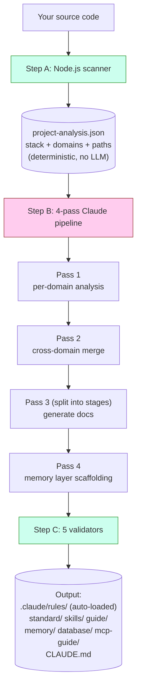
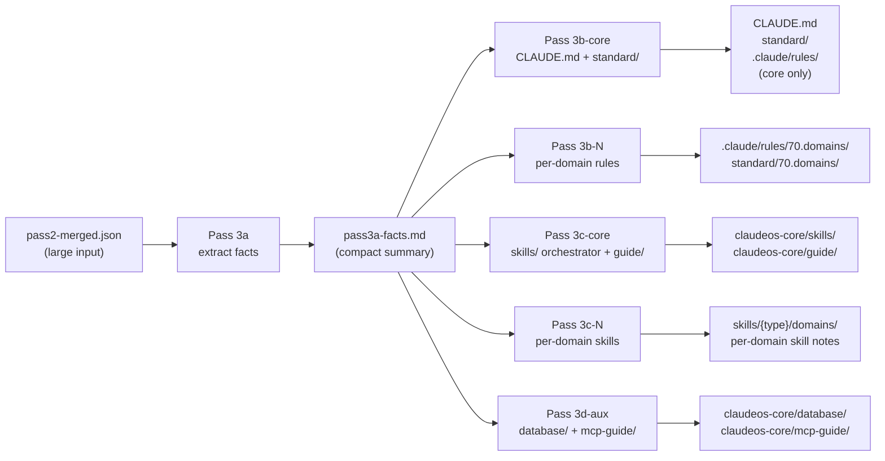
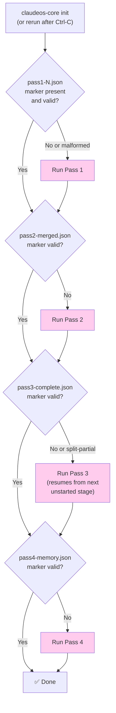
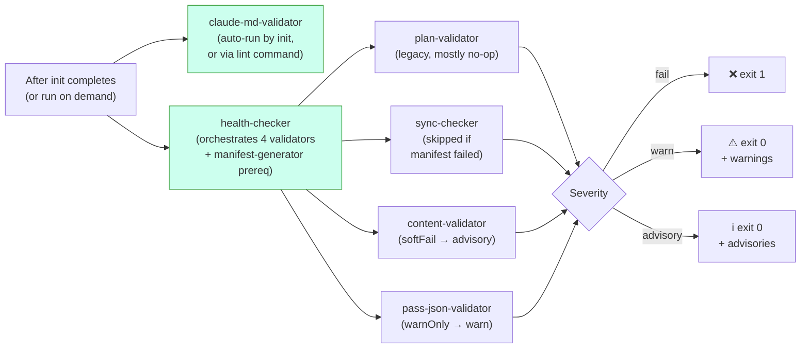
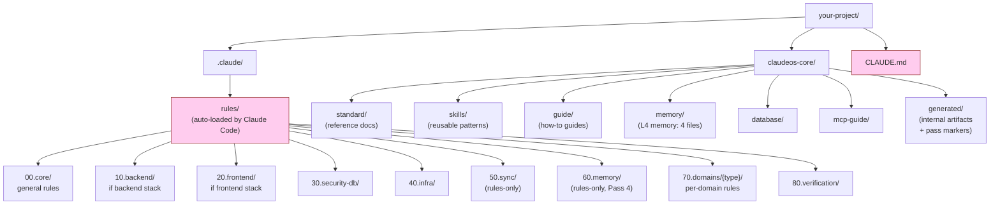

# Diagrams

Architecture का visual reference. सभी diagrams Mermaid में हैं और GitHub पर automatically render हो जाते हैं। Non-Mermaid viewer में पढ़ रहे हैं तो भी prose explanations जानबूझकर self-contained रखी हैं।

> English original: [docs/diagrams.md](../diagrams.md). हिन्दी translation English के साथ sync में रखा है।

सिर्फ़ words वाला version चाहिए तो [architecture.md](architecture.md) देखिए।

---

## `init` कैसे काम करता है (high level)



**हरा** = code (deterministic). **गुलाबी** = Claude (LLM). दोनों एक ही काम पर overlap नहीं करते।

---

## Pass 3 split mode

Pass 3 हमेशा stages में split होता है, project size चाहे जो भी हो, single invocation की तरह कभी नहीं चलता। यह हर stage का prompt LLM के context window के अंदर रखता है, चाहे `pass2-merged.json` बड़ा ही क्यों न हो:



**मुख्य insight:** Pass 3a बड़े input को एक बार पढ़ता है और एक छोटी fact sheet generate करता है। Stages 3b/3c/3d बस वही छोटी fact sheet पढ़ते हैं, बड़ा input दोबारा कभी नहीं। यह "Prompt is too long" errors से बचाता है, जो पहले के non-split designs में परेशानी देती थीं।

16+ domains वाले projects में 3b और 3c और batches में sub-divide हो जाते हैं, हर batch ≤15 domains का। हर batch अपना अलग Claude invocation है, fresh context window के साथ।

---

## Interruption से resume



गुलाबी boxes = Claude invocation. Diamond decisions pure file-system checks हैं, ये किसी भी LLM call से पहले होते हैं।

Marker validation सिर्फ़ "file exist करती है?" नहीं है। हर marker में structural checks हैं (जैसे Pass 4 के marker में `passNum === 4` होना चाहिए और एक non-empty `memoryFiles` array). पिछले crashed runs से malformed markers reject हो जाते हैं और pass दोबारा चलता है।

---

## Verification flow



Three-tier severity का मतलब: CI warnings या advisories पर fail नहीं होता, सिर्फ़ hard failures पर (`fail` tier).

`claude-md-validator` अलग चलता है क्योंकि इसकी findings **structural** हैं। CLAUDE.md malformed है तो सही जवाब `init` को re-run करना है, चुपचाप warn करना नहीं। बाक़ी validators `health` के हिस्से की तरह चलते हैं क्योंकि उनकी findings content-level हैं (paths, manifest entries, schema gaps), जिन्हें सब कुछ regenerate किए बिना review किया जा सकता है।

---

## `init` के बाद file system



**गुलाबी** = हर session पर Claude Code automatically auto-load करता है (manually load नहीं करना पड़ता). बाक़ी सब on demand load होता है, या auto-loaded files से referenced रहता है।

`00`/`10`/`20`/`30`/`40`/`70`/`80` prefixes `rules/` और `standard/` **दोनों** में दिखते हैं. वही conceptual area, अलग role (rules loaded directives हैं, standards reference docs). Numeric prefixes stable sort order देते हैं और Pass 3 orchestrator को category groups address करने देते हैं (जैसे 60.memory Pass 4 लिखता है, 70.domains per batch लिखा जाता है). Rule को actually auto-load कौन trigger करता है, वो इसके YAML frontmatter में `paths:` glob है, category number नहीं।

`50.sync` और `60.memory` **rules-only** हैं (matching `standard/` directory नहीं है). `90.optional` **standard-only** है (enforcement के बिना stack-specific extras).

---

## Memory layer का Claude Code sessions के साथ interaction

```mermaid
flowchart TD
    A["You start a Claude Code session"] --> B{"CLAUDE.md<br/>auto-loaded?"}
    B -->|Yes (always)| C["Section 8 lists<br/>memory/ files"]
    C --> D{"Working file matches<br/>a paths: glob in<br/>60.memory rules?"}
    D -->|Yes| E["Memory rule<br/>auto-loaded"]
    D -->|No| F["Memory not loaded<br/>(saves context)"]

    G["Long session running"] --> H{"Auto-compact<br/>at ~85% context?"}
    H -->|Yes| I["Session Resume Protocol<br/>(prose in CLAUDE.md §8)<br/>tells Claude to re-read<br/>memory/ files"]
    I --> J["Claude continues<br/>with memory restored"]

    style B fill:#fce,stroke:#933
    style D fill:#fce,stroke:#933
    style H fill:#fce,stroke:#933
```

Memory files **on demand** load होती हैं, हमेशा नहीं। इससे normal coding के दौरान Claude का context कम रहता है। ये सिर्फ़ तब खींची जाती हैं जब rule का `paths:` glob उस file से match होता है जिसे Claude अभी edit कर रहा है।

हर memory file में क्या है और compaction algorithm के details के लिए [memory-layer.md](memory-layer.md) देखिए।
