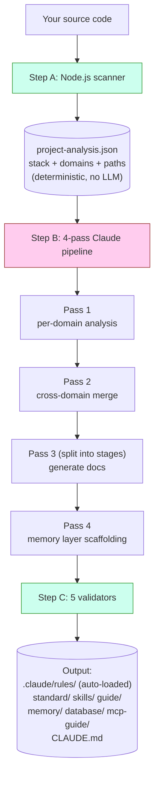
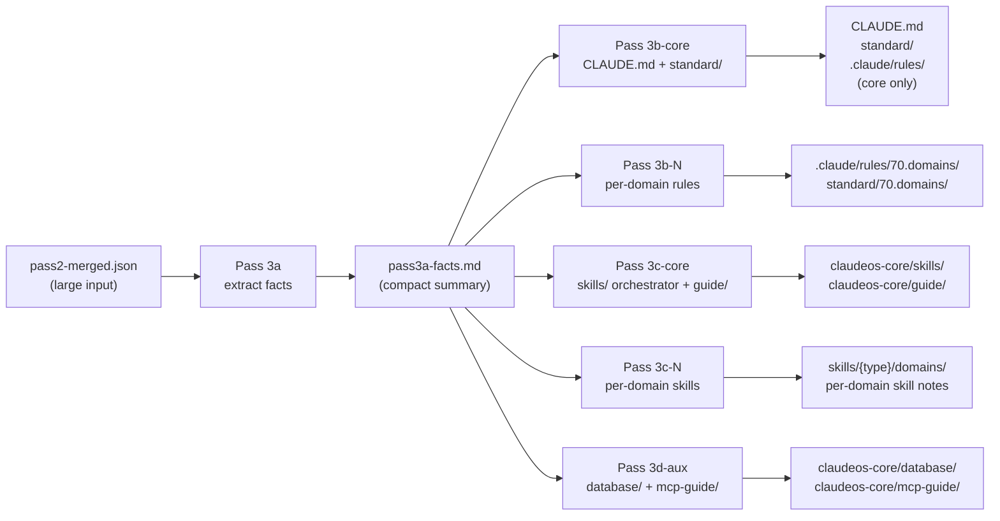
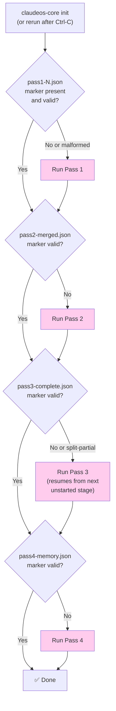
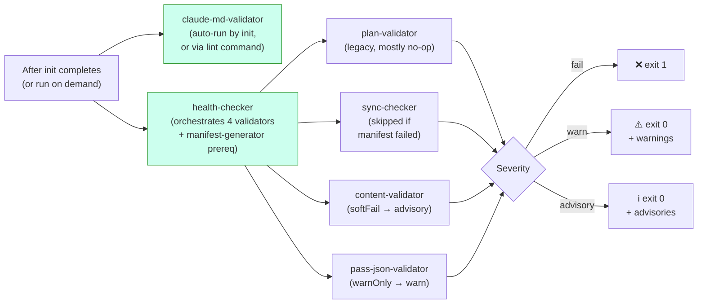
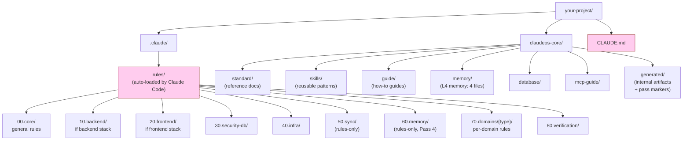

# Diagrams

アーキテクチャの視覚的なリファレンスです。図はすべて Mermaid で、GitHub では自動レンダリングされます。Mermaid 非対応のビューアで読んでいる場合でも、散文の説明だけで意図的に完結するようにしてあります。

文章のみのバージョンは [architecture.md](architecture.md) を参照してください。

> 英語原文: [docs/diagrams.md](../diagrams.md). 日本語訳は英語版に追従して同期されています。

---

## `init` の動作 (高レベル)



**緑** = コード (deterministic)、**ピンク** = Claude (LLM)。両者は同じジョブで重なりません。

---

## Pass 3 split mode

Pass 3 は常にステージ分割します。プロジェクト規模に関わらず、単一呼び出しでは走りません。これは `pass2-merged.json` が大きい場合でも各ステージのプロンプトを LLM のコンテキストウィンドウに収めるためです:



**重要なポイント:** Pass 3a は大きな入力を一度読んで小さな fact sheet を生成します。3b/3c/3d のステージは小さな fact sheet のみを読み、大きな入力を再読込しません。これにより、以前の非 split 設計を悩ませた「Prompt is too long」エラーを避けられます。

16+ ドメインのプロジェクトでは、3b と 3c をさらに ≤15 ドメインのバッチに細分します。各バッチは新しいコンテキストウィンドウを持つ独自の Claude 呼び出しです。

---

## 中断からの resume



ピンクのボックス = Claude が呼ばれます。ひし形の判定は純粋なファイルシステムチェックで、LLM 呼び出しの前に行います。

marker の検証は単に「ファイルが存在するか?」ではなく、それぞれに構造的チェックがあります (例: Pass 4 の marker は `passNum === 4` と非空の `memoryFiles` 配列を含まねばならない)。前回クラッシュした実行からの malformed marker は拒否し、該当 pass を再実行します。

---

## 検証のフロー



3 段階 severity により、CI は warning や advisory では失敗せず、ハードな失敗 (`fail` ティア) だけで失敗します。

`claude-md-validator` を別実行する理由は、その検出が **構造的** だからです。CLAUDE.md が malformed なら正解は `init` の再実行で、静かに warn することではありません。他の validator は検出がコンテンツレベル (パス、manifest エントリ、スキーマギャップ) なので `health` の一部として実行します。それらは全部を再生成しなくてもレビュー可能です。

---

## `init` 後のファイルシステム



**ピンク** = Claude Code が各セッションで自動ロード (手動ロードしない)。それ以外はオンデマンドでロードされるか、自動ロードされたファイルから参照されます。

`00`/`10`/`20`/`30`/`40`/`70`/`80` の prefix は `rules/` と `standard/` の **両方** に出現します。同じ概念領域で、役割が違います (rules はロードされる指示、standards は参照ドキュメント)。番号 prefix は安定したソート順を与え、Pass 3 オーケストレータがカテゴリグループにアドレスできるようにします (例: 60.memory は Pass 4 で書かれ、70.domains はバッチごとに書かれる)。実際に Claude Code がルールを自動ロードするかを決めるのは、カテゴリ番号ではなく YAML frontmatter の `paths:` glob です。

`50.sync` と `60.memory` は **rules-only** (対応する `standard/` ディレクトリなし)、`90.optional` は **standard-only** (強制力のないスタック固有の追加) です。

---

## Memory layer と Claude Code セッションの相互作用

```mermaid
flowchart TD
    A["You start a Claude Code session"] --> B{"CLAUDE.md<br/>auto-loaded?"}
    B -->|Yes (always)| C["Section 8 lists<br/>memory/ files"]
    C --> D{"Working file matches<br/>a paths: glob in<br/>60.memory rules?"}
    D -->|Yes| E["Memory rule<br/>auto-loaded"]
    D -->|No| F["Memory not loaded<br/>(saves context)"]

    G["Long session running"] --> H{"Auto-compact<br/>at ~85% context?"}
    H -->|Yes| I["Session Resume Protocol<br/>(prose in CLAUDE.md §8)<br/>tells Claude to re-read<br/>memory/ files"]
    I --> J["Claude continues<br/>with memory restored"]

    style B fill:#fce,stroke:#933
    style D fill:#fce,stroke:#933
    style H fill:#fce,stroke:#933
```

memory ファイルは **オンデマンド** でロードし、常時ロードしません。これにより通常のコーディング中も Claude のコンテキストが軽く保たれます。ロードするのは、ルールの `paths:` glob が Claude の現在編集ファイルに一致したときだけです。

各 memory ファイルの内容とコンパクションアルゴリズムの詳細は [memory-layer.md](memory-layer.md) を参照してください。
