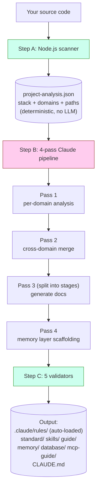
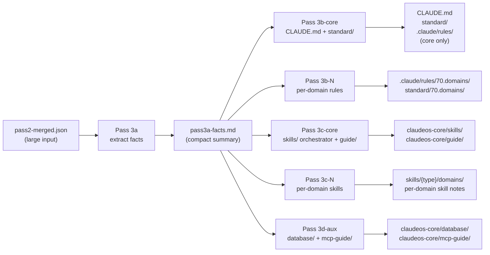
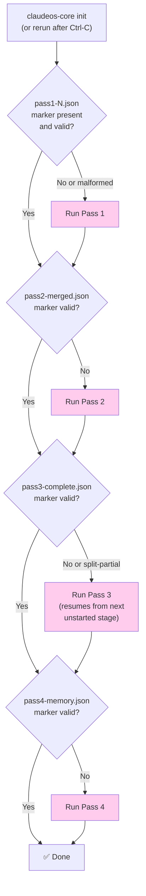
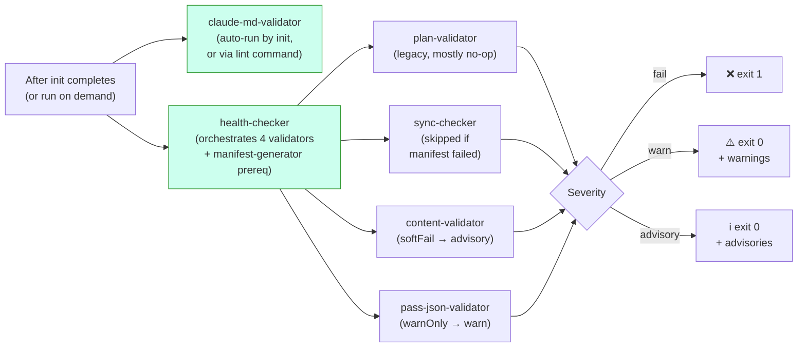
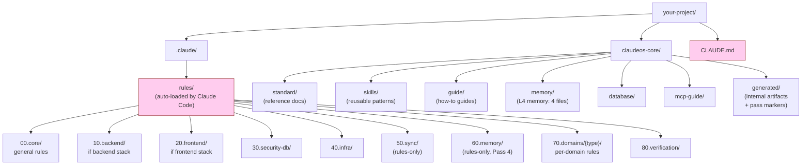

# Diagrams

아키텍처의 시각 reference. 모든 다이어그램은 Mermaid — GitHub에서 자동 렌더링됩니다. Mermaid 미지원 viewer로 보고 있다면, 산문 설명만으로 의도적으로 완결되어 있습니다.

text-only 버전은 [architecture.md](architecture.md) 참고.

> 영문 원본: [docs/diagrams.md](../diagrams.md). 다이어그램 라벨은 영문 그대로 유지 (코드 식별자에 가깝기 때문).

---

## `init` 동작 (high level)



**초록** = 코드 (deterministic). **분홍** = Claude (LLM). 둘은 같은 작업에서 절대 겹치지 않음.

---

## Pass 3 split mode

Pass 3는 항상 stage로 split됩니다 — 프로젝트 크기와 무관하게, 단일 invocation으로 실행되지 않음. 이는 `pass2-merged.json`이 클 때도 각 stage의 prompt가 LLM의 context window 안에 머무르게 합니다:



**핵심 통찰:** Pass 3a는 큰 input을 한 번 읽고 작은 fact sheet를 만듭니다. Stage 3b/3c/3d는 그 작은 fact sheet만 읽고, 큰 merged 파일을 다시 읽지 않습니다. 이는 이전 비-split 설계에서 흔했던 "Prompt is too long" 에러를 방지합니다.

도메인이 16개 이상인 프로젝트에서는 3b와 3c가 ≤15 도메인 batch로 더 분할됩니다. 각 batch는 새 context window를 받는 자체 Claude invocation입니다.

---

## 중단으로부터 resume



분홍 박스 = Claude 호출. 다이아몬드 결정은 순수 file-system 검사 — LLM 호출 전에 이뤄짐.

Marker 검증은 단순히 "파일이 존재하나?"가 아닙니다 — 각 marker는 구조 검사를 가집니다 (예: Pass 4의 marker는 `passNum === 4`와 비어있지 않은 `memoryFiles` array를 포함해야 함). 이전 충돌 실행에서 남은 malformed marker는 거부되고 pass가 재실행됩니다.

---

## Verification 흐름



3-tier severity는 CI가 warning이나 advisory에 실패하지 않고 hard failure (`fail` tier)에만 실패한다는 뜻입니다.

`claude-md-validator`는 별도로 실행됩니다 — 그 발견이 **구조적**이기 때문입니다. CLAUDE.md가 malformed면 정답은 `init`을 재실행하는 것이지 조용히 warning 내는 게 아닙니다. 다른 validator는 `health` 일부로 실행됩니다 — 그 발견이 content-level (경로, manifest 항목, schema 갭)이라 모든 것을 재생성하지 않고 검토 가능하기 때문.

---

## `init` 후 파일 시스템



**분홍** = Claude Code가 매 세션마다 자동 로드 (수동 로드 안 함). 그 외는 demand로 로드되거나 자동 로드 파일에서 참조됩니다.

`00`/`10`/`20`/`30`/`40`/`70`/`80` prefix는 `rules/`와 `standard/` **양쪽에 존재** — 같은 개념 영역이지만 다른 역할 (rules는 로드되는 directive, standard는 reference doc). 숫자 prefix는 안정적인 정렬 순서를 제공하고 Pass 3 orchestrator가 카테고리 그룹을 addressing하게 해줍니다 (예: 60.memory는 Pass 4가 작성, 70.domains는 batch마다 작성). 무엇이 Claude Code가 rule을 자동 로드하게 트리거하는지는 카테고리 번호가 아니라 YAML frontmatter의 `paths:` glob입니다.

`50.sync`와 `60.memory`는 **rules-only** (매치되는 `standard/` 디렉토리 없음). `90.optional`은 **standard-only** (강제력 없는 스택별 추가).

---

## Memory layer의 Claude Code 세션과의 상호작용

```mermaid
flowchart TD
    A["You start a Claude Code session"] --> B{"CLAUDE.md<br/>auto-loaded?"}
    B -->|Yes (always)| C["Section 8 lists<br/>memory/ files"]
    C --> D{"Working file matches<br/>a paths: glob in<br/>60.memory rules?"}
    D -->|Yes| E["Memory rule<br/>auto-loaded"]
    D -->|No| F["Memory not loaded<br/>(saves context)"]

    G["Long session running"] --> H{"Auto-compact<br/>at ~85% context?"}
    H -->|Yes| I["Session Resume Protocol<br/>(prose in CLAUDE.md §8)<br/>tells Claude to re-read<br/>memory/ files"]
    I --> J["Claude continues<br/>with memory restored"]

    style B fill:#fce,stroke:#933
    style D fill:#fce,stroke:#933
    style H fill:#fce,stroke:#933
```

memory 파일은 **on demand**로 로드되며 항상은 아닙니다. 일반 코딩 중에는 Claude의 context를 가볍게 유지합니다. rule의 `paths:` glob이 Claude가 현재 편집 중인 파일과 매치될 때만 끌어들입니다.

각 memory 파일이 무엇을 포함하는지와 compaction 알고리즘의 자세한 내용은 [memory-layer.md](memory-layer.md) 참고.
