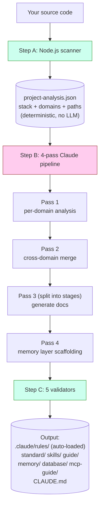
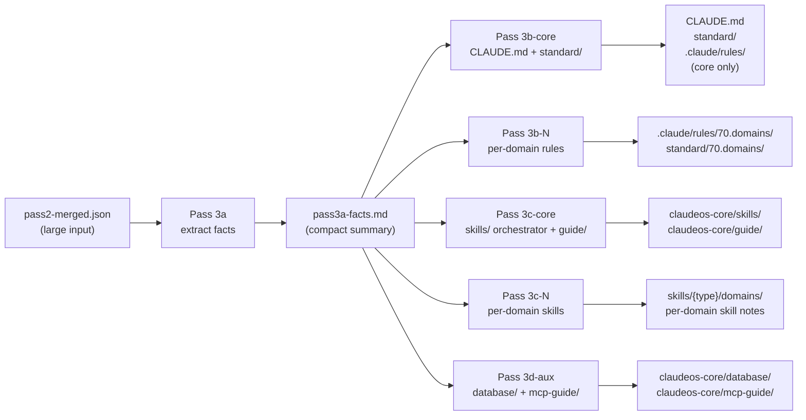
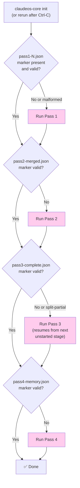
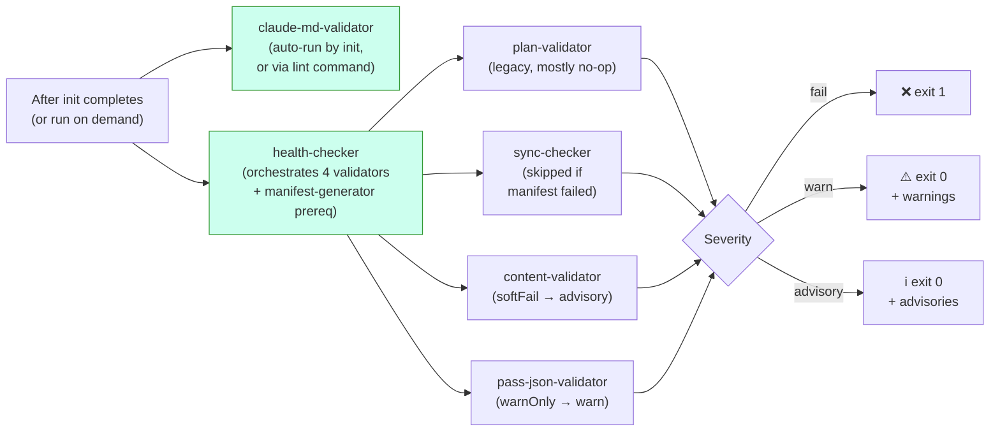
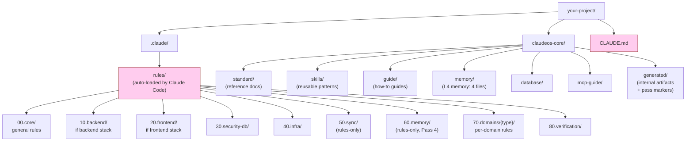

# Diagrams

아키텍처를 시각적으로 보고 싶을 때 펼쳐 보는 문서입니다. 모든 다이어그램은 Mermaid로 그려져 있어 GitHub에서 자동으로 렌더링됩니다. Mermaid를 지원하지 않는 viewer로 보고 있다면, 산문 설명만으로도 내용이 끊기지 않게 일부러 완결되어 있습니다.

텍스트 위주의 버전은 [architecture.md](architecture.md)에 있습니다.

> 영문 원본: [docs/diagrams.md](../diagrams.md). 다이어그램 라벨은 영문 그대로 유지 (코드 식별자에 가깝기 때문).

---

## `init` 동작 (high level)



**초록**은 코드(늘 같은 결과), **분홍**은 Claude(LLM)입니다. 둘은 같은 작업에서 결코 영역이 겹치지 않습니다.

---

## Pass 3 split mode

Pass 3는 프로젝트 크기와 상관없이 늘 stage로 나뉘어 실행됩니다. 단일 호출로는 절대 돌지 않습니다. 그래야 `pass2-merged.json`이 큰 경우에도 각 stage의 prompt가 LLM의 context window 안에 들어맞기 때문입니다.



**핵심 아이디어:** Pass 3a가 큰 input을 한 번 읽어서 작은 fact sheet로 정리합니다. 그러면 Stage 3b/3c/3d는 그 작은 fact sheet만 읽으면 되고, 큰 merged 파일을 다시 펼치지 않아도 됩니다. 덕분에 split 이전 설계에서 자주 만나던 "Prompt is too long" 에러를 피할 수 있습니다.

도메인이 16개 이상인 프로젝트에서는 3b와 3c를 15 도메인 이하 batch로 한 번 더 쪼갭니다. 각 batch는 자체 Claude 호출로 새 context window를 받습니다.

---

## 중단으로부터 resume



분홍 박스는 Claude 호출입니다. 다이아몬드 분기는 순수한 file-system 검사이고, LLM을 부르기 전에 끝납니다.

marker 검증은 단순히 "파일이 있는가?"만 보는 게 아닙니다. 각 marker마다 구조 검사가 따로 있습니다. 예를 들어 Pass 4의 marker는 `passNum === 4`이면서 `memoryFiles` 배열이 비어 있지 않아야 합니다. 이전 실행이 충돌하면서 남긴 malformed marker는 거부되고 해당 pass가 다시 실행됩니다.

---

## Verification 흐름



severity가 3단계로 나뉘어 있다는 건, CI가 warning이나 advisory에는 실패하지 않고 hard failure(`fail` 단계)에만 실패한다는 뜻입니다.

`claude-md-validator`만 따로 실행하는 데에는 이유가 있습니다. 이 validator가 잡아내는 문제는 **구조적**이기 때문이죠. CLAUDE.md가 malformed라면 답은 조용히 warning을 내는 게 아니라 `init`을 다시 돌리는 것입니다. 반면 다른 validator는 `health`의 일부로 돌아갑니다. 이쪽이 잡는 건 콘텐츠 레벨 문제(경로, manifest 항목, schema 갭)이고, 굳이 모든 걸 다시 생성하지 않아도 직접 검토할 수 있기 때문입니다.

---

## `init` 후 파일 시스템



**분홍**은 Claude Code가 매 세션마다 자동으로 불러오는 영역입니다(수동 로드가 아닙니다). 나머지는 필요할 때 불러오거나, 자동 로드 파일에서 참조됩니다.

`00`/`10`/`20`/`30`/`40`/`70`/`80` prefix는 `rules/`와 `standard/` **양쪽에 모두 있습니다**. 같은 개념 영역이지만 역할이 다릅니다. rules는 자동으로 로드되는 directive고, standard는 참고용 문서입니다. 숫자 prefix는 정렬 순서를 안정적으로 잡아 주고, Pass 3 orchestrator가 카테고리 그룹을 지정할 때도 쓰입니다(예: 60.memory는 Pass 4가, 70.domains는 batch마다 씁니다). Claude Code가 룰을 자동으로 로드하게 만드는 건 카테고리 번호가 아니라 YAML frontmatter의 `paths:` glob입니다.

`50.sync`와 `60.memory`는 **rules에만 있습니다**(짝이 되는 `standard/` 디렉토리가 없습니다). `90.optional`은 반대로 **standard에만 있는** 영역으로, 스택별 추가 자료라서 강제력은 없습니다.

---

## Memory layer의 Claude Code 세션과의 상호작용

```mermaid
flowchart TD
    A["You start a Claude Code session"] --> B{"CLAUDE.md<br/>auto-loaded?"}
    B -->|Yes (always)| C["Section 8 lists<br/>memory/ files"]
    C --> D{"Working file matches<br/>a paths: glob in<br/>60.memory rules?"}
    D -->|Yes| E["Memory rule<br/>auto-loaded"]
    D -->|No| F["Memory not loaded<br/>(saves context)"]

    G["Long session running"] --> H{"Auto-compact<br/>at ~85% context?"}
    H -->|Yes| I["Session Resume Protocol<br/>(prose in CLAUDE.md §8)<br/>tells Claude to re-read<br/>memory/ files"]
    I --> J["Claude continues<br/>with memory restored"]

    style B fill:#fce,stroke:#933
    style D fill:#fce,stroke:#933
    style H fill:#fce,stroke:#933
```

memory 파일은 **필요할 때만** 로드되고, 항상 로드되는 게 아닙니다. 일반적인 코딩 작업 중에는 Claude의 context를 가볍게 유지하다가, 룰의 `paths:` glob이 Claude가 지금 편집 중인 파일과 맞을 때만 끌어 옵니다.

각 memory 파일에 어떤 내용이 들어 있는지, compaction 알고리즘은 어떻게 동작하는지는 [memory-layer.md](memory-layer.md)에 자세히 적혀 있습니다.
