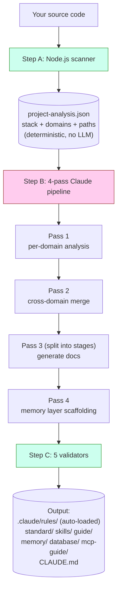
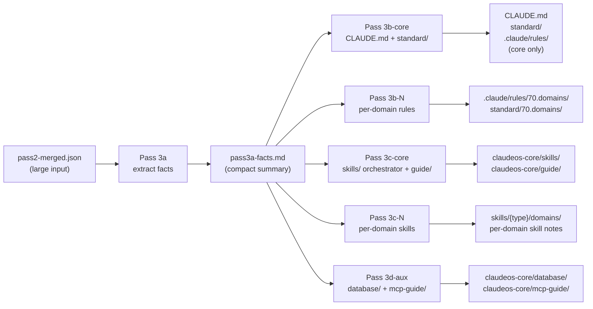
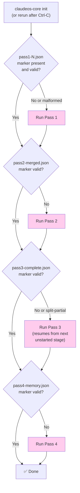
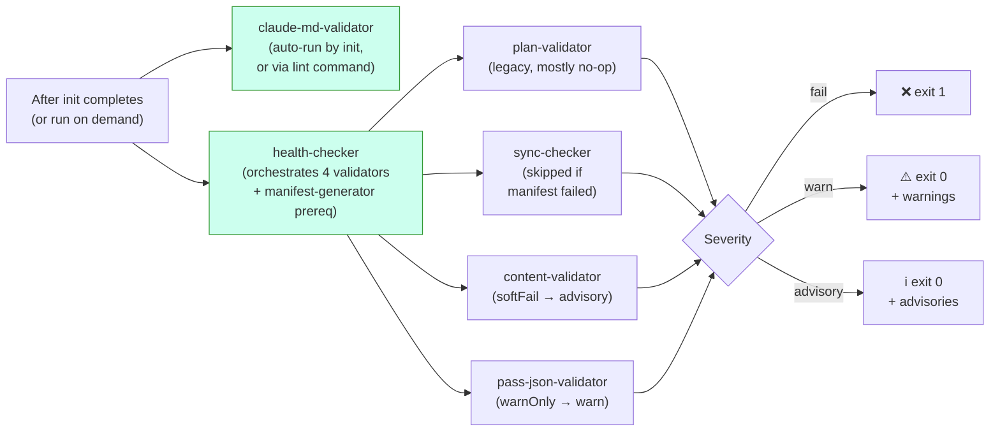
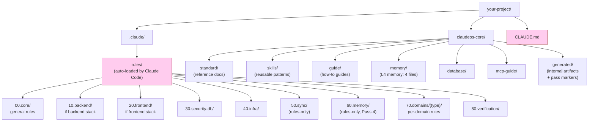

# Диаграммы

Визуальные референсы архитектуры. Все диаграммы Mermaid и автоматически отрисовываются на GitHub. Если читаете это в не-Mermaid просмотрщике, текстовые объяснения намеренно полны и самодостаточны.

Только текстовую версию см. в [architecture.md](architecture.md).

> Английский оригинал: [docs/diagrams.md](../diagrams.md). Русский перевод синхронизирован с английским.

---

## Как работает `init` (high level)



**Зелёный** = код (детерминированный). **Розовый** = Claude (LLM). Эти двое не пересекаются на одной задаче.

---

## Pass 3 split mode

Pass 3 всегда разбивается на стадии и никогда не запускается одним вызовом, независимо от размера проекта. Это удерживает промпт каждой стадии в context window LLM, даже когда `pass2-merged.json` большой:



**Ключевая идея.** Pass 3a один раз читает большой input и выдаёт маленький fact sheet. Стадии 3b/3c/3d читают только маленький fact sheet и никогда не перечитывают большой input. Так уходят ошибки «Prompt is too long», которые мучили более ранние не-split-дизайны.

Для проектов с 16+ доменами 3b и 3c дополнительно делятся на батчи по ≤15 доменов. Каждый батч — собственный вызов Claude со свежим context window.

---

## Возобновление после прерывания



Розовые блоки = Claude вызывается. Ромбические решения — чистые проверки файловой системы, выполняются до любого вызова LLM.

Валидация маркера — это не просто «существует ли файл?». У каждого маркера есть структурные проверки (например, маркер Pass 4 должен содержать `passNum === 4` и непустой массив `memoryFiles`). Malformed-маркеры от упавших предыдущих запусков отклоняются, и pass перезапускается.

---

## Поток верификации



При трёхуровневой severity CI не падает на warning или advisory — только на жёстких провалах (уровень `fail`).

`claude-md-validator` запускается отдельно, потому что его находки **структурные**: если CLAUDE.md malformed, правильный ответ — перезапустить `init`, а не молча предупреждать. Остальные validator запускаются как часть `health`: их находки content-уровневые (пути, записи manifest, пробелы схемы), и их можно просмотреть, не регенерируя всё.

---

## Файловая система после `init`



**Розовый** = Claude Code загружает автоматически в каждой сессии, вручную ничего загружать не надо. Всё остальное загружается по требованию или подтягивается ссылками из автозагружаемых файлов.

Префиксы `00`/`10`/`20`/`30`/`40`/`70`/`80` встречаются и в `rules/`, и в `standard/`: одна концептуальная область, разные роли. Rules — это loaded directives, standards — справочные документы. Числовые префиксы дают стабильный порядок сортировки и позволяют Pass 3 orchestrator адресовать группы категорий (например, 60.memory пишет Pass 4, 70.domains пишется per-batch). А что реально триггерит Claude Code на автозагрузку правила, так это glob `paths:` в его YAML frontmatter, а не число категории.

`50.sync` и `60.memory` — **только rules** (соответствующего каталога `standard/` нет). `90.optional` — **только standard** (специфика стека без принуждения).

---

## Взаимодействие memory layer с сессиями Claude Code

```mermaid
flowchart TD
    A["You start a Claude Code session"] --> B{"CLAUDE.md<br/>auto-loaded?"}
    B -->|Yes (always)| C["Section 8 lists<br/>memory/ files"]
    C --> D{"Working file matches<br/>a paths: glob in<br/>60.memory rules?"}
    D -->|Yes| E["Memory rule<br/>auto-loaded"]
    D -->|No| F["Memory not loaded<br/>(saves context)"]

    G["Long session running"] --> H{"Auto-compact<br/>at ~85% context?"}
    H -->|Yes| I["Session Resume Protocol<br/>(prose in CLAUDE.md §8)<br/>tells Claude to re-read<br/>memory/ files"]
    I --> J["Claude continues<br/>with memory restored"]

    style B fill:#fce,stroke:#933
    style D fill:#fce,stroke:#933
    style H fill:#fce,stroke:#933
```

Memory-файлы загружаются **по требованию**, а не всегда. Это держит контекст Claude худым во время обычного кодинга. Они подтягиваются только когда glob `paths:` правила совпадает с файлом, который Claude в этот момент редактирует.

Подробности по содержимому каждого memory-файла и алгоритму компактации см. в [memory-layer.md](memory-layer.md).
