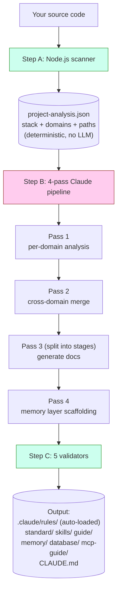
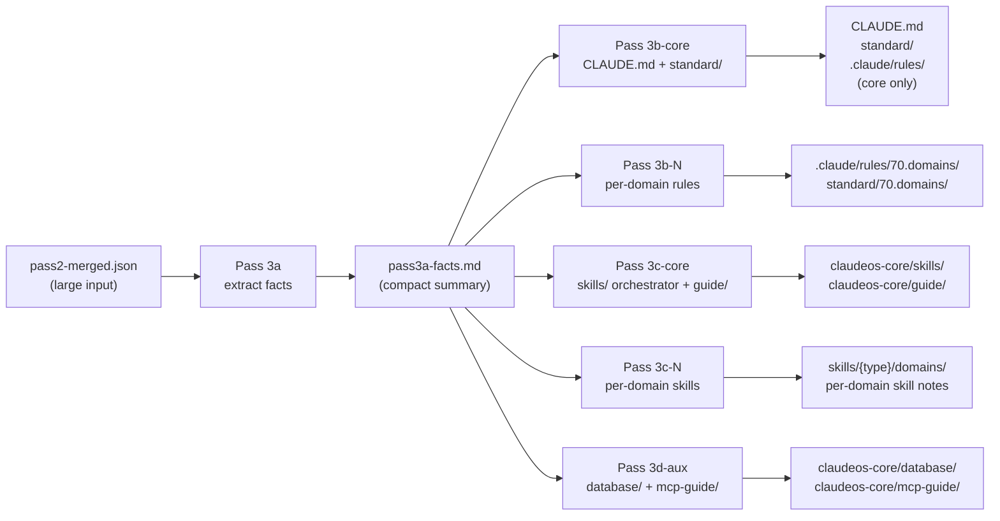
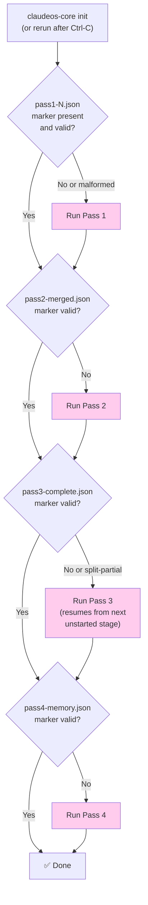
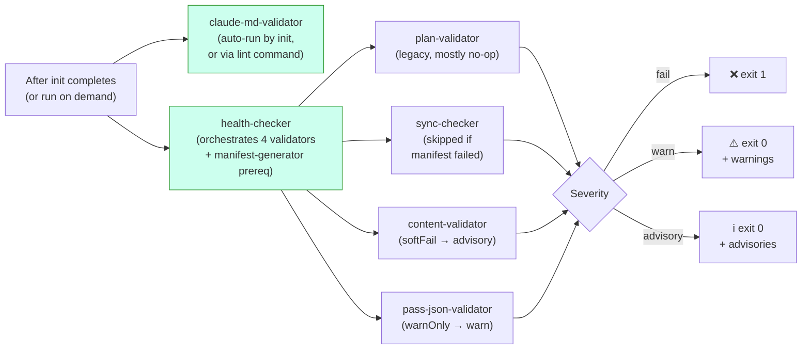
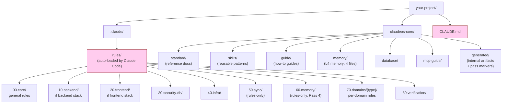

# Diagrams

Tham chiếu trực quan cho kiến trúc. Tất cả diagram đều dùng Mermaid — tự render trên GitHub. Nếu bạn đang đọc trong viewer không hỗ trợ Mermaid, các giải thích văn bản được viết đầy đủ một cách có chủ đích để đứng độc lập.

Bản chỉ-văn-bản xem [architecture.md](architecture.md).

> Bản gốc tiếng Anh: [docs/diagrams.md](../diagrams.md). Bản dịch tiếng Việt được đồng bộ với bản tiếng Anh.

---

## Cách `init` hoạt động (mức tổng quan)



**Xanh lá** = code (deterministic). **Hồng** = Claude (LLM). Hai bên không bao giờ chồng lên cùng một công việc.

---

## Pass 3 split mode

Pass 3 luôn tách thành các stage — không bao giờ chạy như một lần gọi duy nhất, bất kể kích thước dự án. Điều này giữ prompt mỗi stage trong context window của LLM ngay cả khi `pass2-merged.json` lớn:



**Insight then chốt:** Pass 3a đọc input lớn một lần và sản xuất một fact sheet nhỏ. Stage 3b/3c/3d chỉ đọc fact sheet nhỏ, không bao giờ đọc lại input lớn. Điều này tránh các lỗi "Prompt is too long" từng làm phiền các thiết kế non-split trước đây.

Với dự án có 16+ domain, 3b và 3c chia nhỏ hơn nữa thành các batch ≤15 domain mỗi batch. Mỗi batch là một lần gọi Claude riêng với context window mới.

---

## Resume từ chỗ bị gián đoạn



Khối hồng = Claude được gọi. Các quyết định hình thoi là kiểm tra hệ thống tệp thuần — chúng xảy ra trước bất kỳ lệnh gọi LLM nào.

Xác minh marker không chỉ là "tệp có tồn tại không?" — mỗi marker có kiểm tra cấu trúc (ví dụ marker của Pass 4 phải chứa `passNum === 4` và mảng `memoryFiles` không rỗng). Marker malformed từ lần chạy trước bị crash sẽ bị từ chối và pass chạy lại.

---

## Luồng verification



Mức nghiêm trọng ba bậc nghĩa là CI không fail vì warning hay advisory — chỉ fail trên các fail cứng (mức `fail`).

`claude-md-validator` chạy riêng vì các phát hiện của nó là **cấu trúc** — nếu CLAUDE.md bị malformed, đáp án đúng là chạy lại `init`, không phải lặng lẽ warning. Các validator khác chạy như một phần của `health` vì phát hiện của chúng ở mức nội dung (đường dẫn, mục manifest, lỗ hổng schema) — có thể xem xét mà không sinh lại tất cả.

---

## Hệ thống tệp sau `init`



**Hồng** = Claude Code tự nạp mỗi phiên (bạn không cần nạp thủ công). Mọi thứ khác được nạp theo nhu cầu hoặc tham chiếu từ các tệp tự nạp.

Các tiền tố `00`/`10`/`20`/`30`/`40`/`70`/`80` xuất hiện ở **cả** `rules/` và `standard/` — cùng vùng khái niệm, vai trò khác (rules là chỉ thị được nạp, standards là tài liệu tham chiếu). Tiền tố số cho thứ tự sắp xếp ổn định và để Pass 3 orchestrator có thể đánh địa chỉ các nhóm category (ví dụ 60.memory được Pass 4 ghi, 70.domains được ghi theo batch). Cái thực sự kích hoạt Claude Code tự nạp một rule là glob `paths:` trong YAML frontmatter của nó, không phải số category.

`50.sync` và `60.memory` là **chỉ-rules** (không có thư mục `standard/` tương ứng). `90.optional` là **chỉ-standard** (mở rộng riêng stack, không cưỡng chế).

---

## Tương tác memory layer với phiên Claude Code

```mermaid
flowchart TD
    A["You start a Claude Code session"] --> B{"CLAUDE.md<br/>auto-loaded?"}
    B -->|Yes (always)| C["Section 8 lists<br/>memory/ files"]
    C --> D{"Working file matches<br/>a paths: glob in<br/>60.memory rules?"}
    D -->|Yes| E["Memory rule<br/>auto-loaded"]
    D -->|No| F["Memory not loaded<br/>(saves context)"]

    G["Long session running"] --> H{"Auto-compact<br/>at ~85% context?"}
    H -->|Yes| I["Session Resume Protocol<br/>(prose in CLAUDE.md §8)<br/>tells Claude to re-read<br/>memory/ files"]
    I --> J["Claude continues<br/>with memory restored"]

    style B fill:#fce,stroke:#933
    style D fill:#fce,stroke:#933
    style H fill:#fce,stroke:#933
```

Tệp memory được nạp **theo nhu cầu**, không phải luôn luôn. Điều này giữ context của Claude gọn trong coding bình thường. Chúng chỉ được kéo vào khi glob `paths:` của rule khớp tệp Claude đang chỉnh.

Chi tiết về nội dung mỗi tệp memory và thuật toán compaction xem [memory-layer.md](memory-layer.md).
