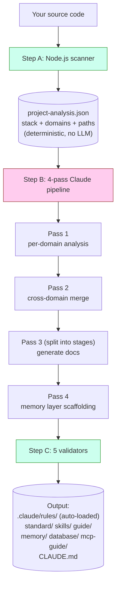
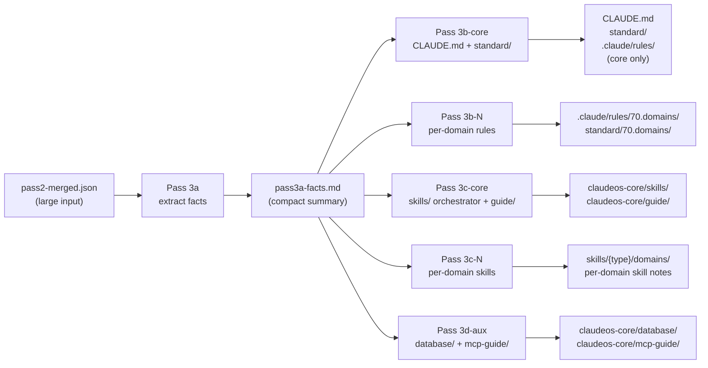
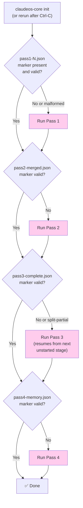
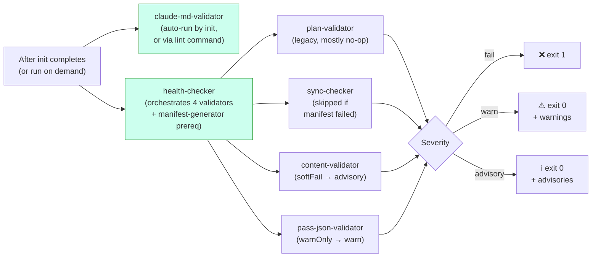
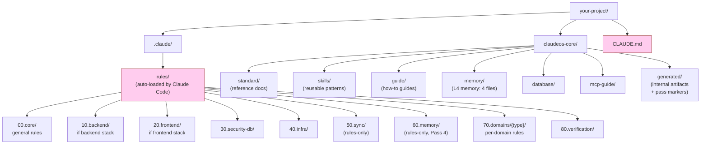

# Diagrams

架构的可视化参考。所有图都是 Mermaid,在 GitHub 上自动渲染。用的查看器不渲染 Mermaid 时,正文说明本身已刻意写成完整的。

只看文字版的话,见 [architecture.md](architecture.md)。

> 英文原文: [docs/diagrams.md](../diagrams.md)。中文译文与英文同步。

---

## `init` 是怎么工作的(高层)



**绿色** = 代码(deterministic)。**粉色** = Claude(LLM)。两者从不在同一份工作上重叠。

---

## Pass 3 split mode

Pass 3 始终拆成多个 stage,不管项目大小都不会作为单次调用运行。这样即使 `pass2-merged.json` 很大,每个 stage 的 prompt 也能装进 LLM 的 context window:



**关键点:** Pass 3a 把大 input 读一次,产出一份小事实表。Stage 3b/3c/3d 只读这份小事实表,从不重读那份大 input。这样就避开了早期非 split 设计里常见的 "Prompt is too long" 错误。

16+ 域的项目里,3b 与 3c 进一步细分,每批 ≤15 域。每个 batch 都是独立的 Claude 调用,拿到新的 context window。

---

## 从中断恢复



粉色框 = 调用 Claude。菱形决策都是纯文件系统检查,发生在任何 LLM 调用之前。

marker 验证不止"文件存在吗?",每个 marker 都有结构性检查(比如 Pass 4 的 marker 必须包含 `passNum === 4` 和非空 `memoryFiles` 数组)。上次崩溃留下的 malformed marker 会被拒收,该 pass 会重跑。

---

## 验证流程



三档严重度意味着 CI 不会因 warning 或 advisory 而失败,只在硬失败(`fail` 档)时失败。

`claude-md-validator` 单独跑,因为它的发现是**结构性的**:CLAUDE.md 一旦 malformed,正确做法是重跑 `init`,而不是悄悄警告。其他 validator 作为 `health` 的一部分运行,因为它们的发现是内容级(路径、manifest 条目、schema 缺口),不用重新生成所有内容也能审阅。

---

## `init` 之后的文件系统



**粉色** = Claude Code 每次会话都会自动加载(不用手动加)。其余按需加载,或被自动加载的文件引用。

`00`/`10`/`20`/`30`/`40`/`70`/`80` 的 prefix 在 `rules/` 与 `standard/` 中**都**出现:同一概念领域,不同角色(rule 是要加载的指令,standard 是参考文档)。数字 prefix 提供稳定排序,也让 Pass 3 orchestrator 能按类别组处理(比如 60.memory 由 Pass 4 写,70.domains 按 batch 写)。真正触发 Claude Code 自动加载某条 rule 的,是它 YAML frontmatter 里的 `paths:` glob,而不是类别号。

`50.sync` 与 `60.memory` 是 **rules-only**(没有对应的 `standard/` 目录)。`90.optional` 是 **standard-only**(无强制力的栈相关附加内容)。

---

## Memory layer 与 Claude Code 会话的交互

```mermaid
flowchart TD
    A["You start a Claude Code session"] --> B{"CLAUDE.md<br/>auto-loaded?"}
    B -->|Yes (always)| C["Section 8 lists<br/>memory/ files"]
    C --> D{"Working file matches<br/>a paths: glob in<br/>60.memory rules?"}
    D -->|Yes| E["Memory rule<br/>auto-loaded"]
    D -->|No| F["Memory not loaded<br/>(saves context)"]

    G["Long session running"] --> H{"Auto-compact<br/>at ~85% context?"}
    H -->|Yes| I["Session Resume Protocol<br/>(prose in CLAUDE.md §8)<br/>tells Claude to re-read<br/>memory/ files"]
    I --> J["Claude continues<br/>with memory restored"]

    style B fill:#fce,stroke:#933
    style D fill:#fce,stroke:#933
    style H fill:#fce,stroke:#933
```

memory 文件**按需加载**,不是始终加载。这样 Claude 在常规编码中的 context 保持精简。只有 rule 的 `paths:` glob 匹配到 Claude 当前编辑的文件时,memory 才会被拉进来。

每个 memory 文件包含什么、压缩算法的细节,见 [memory-layer.md](memory-layer.md)。
